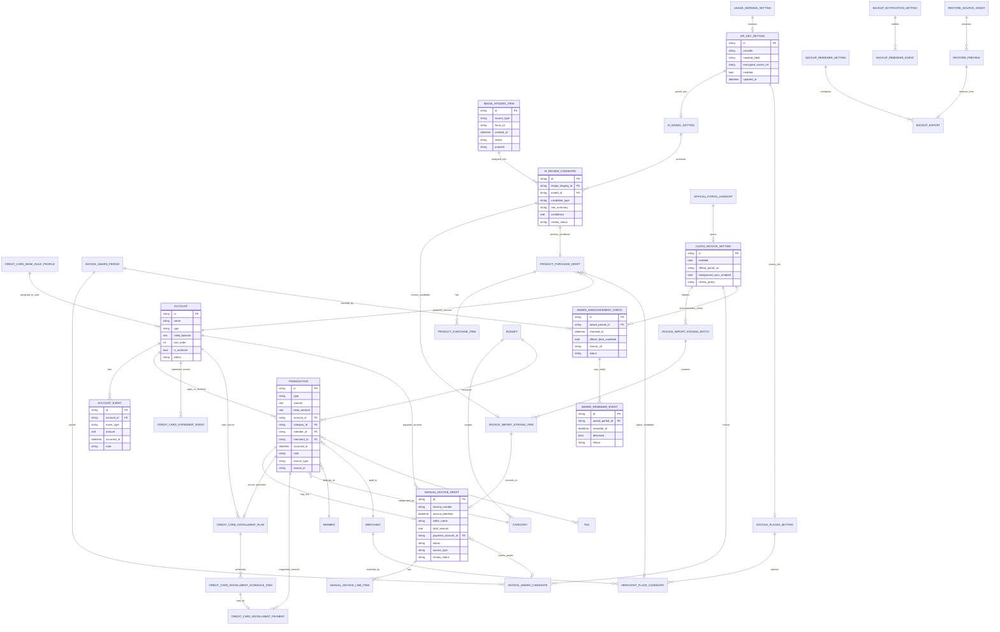

# Overall Delivery ERD

最後更新：2026-06-13  
階段：P4.10.22 Overall Delivery Architecture Viewer  
Issue：#378

---

## 1. 圖例

| 標記 | 意義 |
|---|---|
| `current` | repo 中已具備主要模型或資料流程 |
| `planned` | 最終交付需要補齊 |
| `external` | 外部資源 / 使用者提供 key / 系統資源 |
| `candidate` | 候選資料，需審核後才可轉正式紀錄 |

---

## 2. Mermaid ER Diagram

---

## 3. Entity status matrix

| Entity | 狀態 | 對應功能 | 備註 |
|---|---|---|---|
| ACCOUNT | current | 帳戶頁、付款帳戶 | #369 需用於發票付款帳戶下拉 |
| ACCOUNT_EVENT | current | 帳戶事件 | 帳戶明細與餘額追溯 |
| TRANSACTION | current | 首頁、報表、帳戶明細 | 正式日常紀錄 |
| CREDIT_CARD_INSTALLMENT_PLAN | current | 計劃頁 | 分期管理 |
| CREDIT_CARD_INSTALLMENT_SCHEDULE_ITEM | current | 計劃頁 | 分期排程 |
| MANUAL_INVOICE_DRAFT | current / partial | 手輸入發票 | 需補付款帳戶關聯與刷新 |
| INVOICE_IMPORT_STAGING_ITEM | current / partial | QR / 雲端 / AI 發票候選 | 候選資料不可直接變正式交易 |
| INVOICE_AWARD_PERIOD | planned / partial | 發票對獎 | 需要對應期別、獎號與公告狀態 |
| INVOICE_AWARD_CANDIDATE | planned / partial | 發票對獎 | 結果必須 review-first |
| AWARD_ANNOUNCEMENT_CHECK | planned | 發票對獎提醒 | 開獎日下午約 15:00 後確認官方資料可用 |
| AWARD_REMINDER_EVENT | planned | 發票對獎提醒 | 可提醒、可關閉，不自動領獎 |
| IMAGE_STAGING_ITEM | current / partial | 拍商品 / 影像來源 | 需 route 與 review flow 完整化 |
| AI_MODEL_SETTING | planned | 我的 > 設定中心 | Gemini key、模型測試、費用警示 |
| GOOGLE_PLACES_SETTING | planned | 我的 > 設定中心 | Places key、商家候選、配額警示 |
| CLOUD_INVOICE_SETTING | planned | 我的 > 設定中心 | 雲端發票設定、官方入口、對獎治理 |
| BUDGET | planned / partial | 首頁月預算 | 需補正式設定與資料表 |
| CATEGORY | planned / partial | 記帳類別、時間預設類別 | 支援早餐/午餐/晚餐/下午茶預設 |

---

## 4. 外部資源關係

| External resource | Local entity | 使用者動作 | 驗收重點 |
|---|---|---|---|
| Gemini API | API_KEY_SETTING, AI_MODEL_SETTING, AI_REVIEW_CANDIDATE | 輸入 key、手動測試、手動分析影像 | key 遮罩、可測試、不可自動建立交易 |
| Google Places API | API_KEY_SETTING, GOOGLE_PLACES_SETTING, MERCHANT_PLACE_CANDIDATE | 輸入 key、查詢商家候選 | 費用/次數警示、可取消、結果可審核 |
| 財政部電子發票平台 | CLOUD_INVOICE_SETTING, OFFICIAL_PORTAL_HANDOFF, INVOICE_IMPORT_STAGING_BATCH, AWARD_ANNOUNCEMENT_CHECK | 開啟官方入口、匯入候選、確認開獎資訊或對獎 | 不保管帳密、結果先進 staging / review-first |
| Camera / Gallery | IMAGE_STAGING_ITEM | 使用者點擊拍照或選圖 | 權限由使用者觸發、本機候選 |
| Local notification | BACKUP_NOTIFICATION_SETTING, AWARD_REMINDER_EVENT | 開啟提醒 | 可關閉、可測試通知 |
| File picker / Share sheet | BACKUP_EXPORT, RESTORE_SOURCE_GRANT | 備份、還原、匯入匯出 | 預覽與確認後執行 |

---

## 5. ERD 驗收條件

- 五大分頁功能都能映射到至少一個 entity 或 external resource。
- 候選資料、草稿、正式交易三層界線清楚。
- API key 與外部查詢設定集中在 My page settings center。
- 發票對獎具備期別、官方資訊可用性檢查、提醒事件與 review-first 結果。
- #369、#370、#376、#380、#381 等後續 issue 可依此圖拆解實作範圍。
